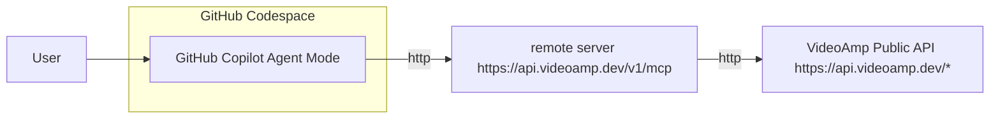
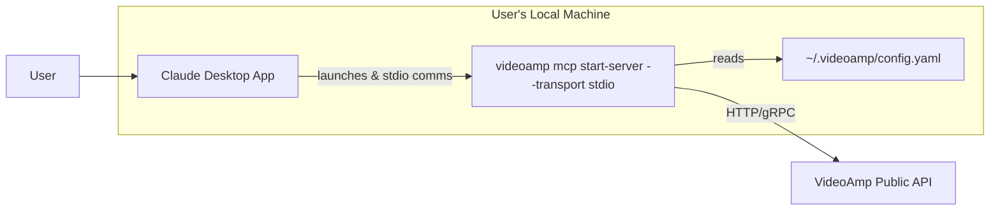
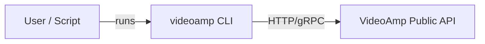

# VideoAmp Tools

Tools are available via the VideoAmp MCP Server and CLI.  All tools are intended to streamline workflows and integrations with VideoAmp's APIs. Detailed API specs can be found at https://docs.videoamp.dev.

---

## Copilot (remote server, zero install)

This option launches a GitHub Codespace with Copilot connected to the remote VideoAmp MCP Server and requires zero local installation.  The CLI may also be accessed using the command `videoamp` from a terminal.

1. Create a [GitHub Codespace](https://github.com/codespaces/new?hide_repo_select=true&ref=main&repo=894753956).
2. In Copilot, select mode `Agent` and a recent model, e.g., `Claude Sonnet 4.5`, `Chat GPT-5`.

   

3. Prompt Copilot: "Show videoamp audiences I can access." or "What other VideoAmp tools can I use?"

### Details



**Client Location:** Copilot in GitHub Codespace

**Server Location:** https://api.videoamp.dev/v1/mcp

**Authentication:** VideoAmp OAuth login

### Prerequisites 

* GitHub account
* GitHub Copilot access

---

## Claude Desktop (local install)

### Mac(apple silicon)
1. Download [VideoAmp-MCP-darwin-arm64.mcpb](https://github.com/VideoAmp/cli/releases/download/v0.43.1/VideoAmp-MCP-darwin-arm64.mcpb).
2. Double-click the downloaded file.
3. Click Install.

   

4. Ask Claude, "What VideoAmp tools can I use?" or "Show questions I can ask VideoAmp."

### Windows

1. Coming soon.

### Details



**Client Location:** Anthropic's Claude Desktop application running on the user's local machine.

**Server Location:** The `videoamp mcp start-server --transport stdio` process runs locally on the user's machine, launched by Claude Desktop.

**Authentication:** Relies on the user having previously logged in via the `videoamp login` command in their terminal. The locally running MCP server (using stdio transport) reads the stored access token from the user's local CLI configuration file to authenticate API calls.

### Prerequisites

* Requires installing Claude Desktop.
* Requires downloading and installing the appropriate .mcpb file.
* Requires the user to manage their VideoAmp CLI login state separately via a terminal.
* The MCP server process runs locally, so ensuring the correct version is the user's responsibility.
* Only available for macOS (Apple Silicon) initially, Windows "coming soon".

---

## General CLI Installation

This option describes how to install the videoamp executable locally for direct use from a command line terminal.

1. Visit the [releases page](https://github.com/VideoAmp/cli/releases) and download the asset that matches your OS and CPU architecture (for example, `videoamp_v0.10.0_linux_amd64.tar.gz`, `videoamp_v0.10.0_darwin_arm64.tar.gz`, or `videoamp_v0.10.0_windows_amd64.zip`).

2. Extract the archive and move the `videoamp` executable somewhere on your `$PATH`:

   **macOS/Linux:**
   
   ```bash
   tar -xzf videoamp_<version>_<os>_<arch>.tar.gz
   sudo mv videoamp /usr/local/bin/
   chmod +x /usr/local/bin/videoamp
   ```

   **Windows (PowerShell):**
   
   ```powershell
   Expand-Archive -Path .\videoamp_<version>_windows_amd64.zip -DestinationPath .
   Move-Item -Path .\videoamp.exe -Destination $env:USERPROFILE\AppData\Local\Microsoft\WindowsApps\videoamp.exe
   ```

3. Confirm the installation:

   ```bash
   videoamp --help
   ```

### Details



**Client Location:** The user's terminal or an automation script running on the user's machine.

**Server Location:** N/A - CLI communicates directly with VideoAmp APIs.

**Authentication:** User runs `videoamp login` in the terminal. The CLI manages the `access_token` in ~/.videoamp/config.yaml.

---
